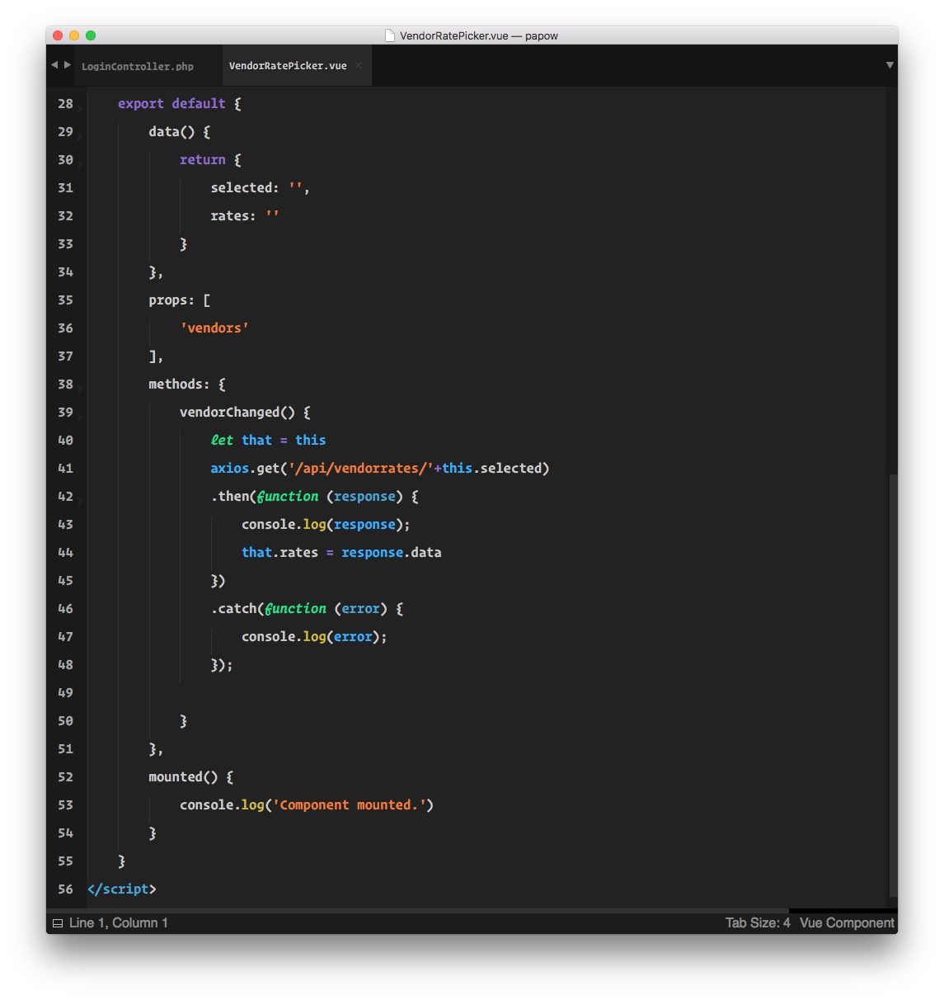

# Zero Dark Matrix Reloaded

ZDMR is a Sublime Text syntax theme derived from Zero Dark Matrix, a theme most proliferated as the dark syntax highlighting option in Chrome's Dev Tools.

## Installation

Transport the .tmTheme to your User directory.  Set Zero Dark Matrix Reloaded as your theme.  Profit.

## Contributing

1. Fork it!
2. Create your feature branch: `git checkout -b my-new-feature`
3. Commit your changes: `git commit -am 'Add some feature'`
4. Push to the branch: `git push origin my-new-feature`
5. Submit a pull request :D

Also, if you care about getting this into Package Control, I'd accept a push towards that.  I just don't care enough to do it myself.

## License

This package is under the MIT License.
